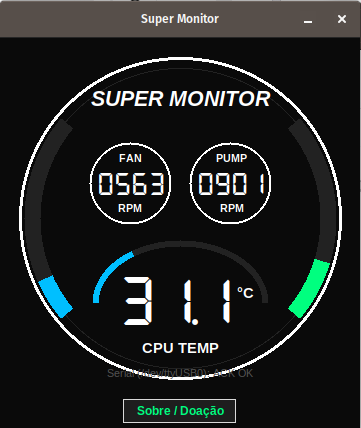

# Super Monitor — Water Cooler Controller & HUD

**Super Monitor** é um utilitário desenvolvido para sistemas Linux para leitura em tempo real da temperatura da CPU e rotação das ventoinhas (Fan Speed), transmitindo os dados via comunicação Serial USB (CH340/CH341) para displays de Water Coolers e exibindo uma interface gráfica elegante no desktop.

---

## 📸 Demonstração do Sistema

| Interface do Aplicativo | Hardware em Funcionamento |
| :---: | :---: |
|  |  |
| *GUI Desktop em Tkinter com fontes 7 segmentos e arcos dinâmicos* | *Display LCD do Water Cooler sincronizado em tempo real via Serial USB* |

---

## 🎯 Compatibilidade e Testes

- **Dispositivo Testado:** Compatível e homologado no modelo **SuperFrame Smart 240mm (Bomba Infinity)**.
- **Controladores USB Serial Suportados:** CH340, CH341, CH340S (VID: `0x1A86`).
- **Sistema Operacional:** Linux (com suporte a `/sys/class/hwmon` para leitura de sensores).

---

## ⚙️ Funcionalidades principais

1. **Leitura Não-Invasiva de Sensores:** Lê a temperatura média dos núcleos da CPU (`coretemp`, `k10temp`, `zenpower`) e rotação de ventoinhas diretamente dos barramentos do kernel (`hwmon`).
2. **Sincronização Serial USB:** Protocolo de comunicação com envio automático de Keepalive (`0x02, 0x01, 0x00`) e frames de status para o display.
3. **Cálculo da Rotação da Bomba (PUMP Speed):** A rotação informada para a bomba é **proporcional e calculada** a partir do FAN Speed real lido no sistema.
4. **Interface Gráfica Responsiva:** Desenhada via Tkinter Canvas com renderização de arcos de progresso, alertas de cor por nível de temperatura e suporte a fontes digitais estilo 7 segmentos.

---

## ⚠️ AVISOS E TERMOS IMPORTANTE DE HARDWARE

> 💡 **Nota sobre o indicador PUMP Speed:**
> O dado de velocidade da bomba (**PUMP Speed**) exibido na tela do software e enviado ao display é **baseado matematicamente no Fan Speed** e **NÃO reflete a velocidade real física da bomba de refrigeração**.
> 
> Caso queira que o valor reflita a rotação física real da bomba, é necessário conectar o sensor físico da bomba ao conector **PUMP_FAN / PUMP_IO** dedicado da sua placa-mãe e realizar adaptações no código-fonte para ler o sensor correspondente em `/sys/class/hwmon/`.

---

## 🛠️ Instalação e Configuração

Consulte o guia completo em [INSTALL.md](INSTALL.md) para:
- Instalação de dependências (`python3-tk`, `pyserial`, `Pillow`, `fonts-dseg`).
- Permissões de porta serial (`dialout` / `udev rules`).
- Instalação das fontes estilo 7 segmentos.
- Configuração do autostart (Inicialização Automática com o sistema).

---

## 📄 Licença e Termos Legais

Este projeto está licenciado sob os termos da licença [MIT](LICENSE).

### Termos de Isenção de Responsabilidade (Disclaimer)
1. **Ausência de Vínculo Comercial:** Embora o aplicativo seja compatível e testado no modelo *SuperFrame Smart 240mm*, o autor/desenvolvedor **não possui qualquer vínculo, associação, patrocínio ou responsabilidade** com a marca fabricante ou distribuidora do dispositivo.
2. **Propriedade Intelectual e Marcas:** Quaisquer marcas, nomes de produtos, logotipos ou modelos citados nesta documentação e código pertencem exclusivamente aos seus respectivos proprietários e são aqui utilizados **apenas para fins informativos e de identificação de compatibilidade**.
3. **Leitura Segura:** O software realiza **apenas a leitura** dos sensores do sistema e envio de dados para exibição visual. Ele **não altera** o funcionamento, perfis de ventoinha ou voltagens da BIOS/hardware.
4. **Isenção de Danos:** O software é fornecido "COMO ESTÁ" (*AS IS*), sem garantias de qualquer tipo. O uso, modificação ou redistribuição do código é por sua conta e risco.

---

## 🤝 Apoie o Projeto

Se este software foi útil para você, considere apoiar o desenvolvimento voluntário através da chave Pix disponibilizada no botão **Sobre / Doação** na própria interface do programa.
